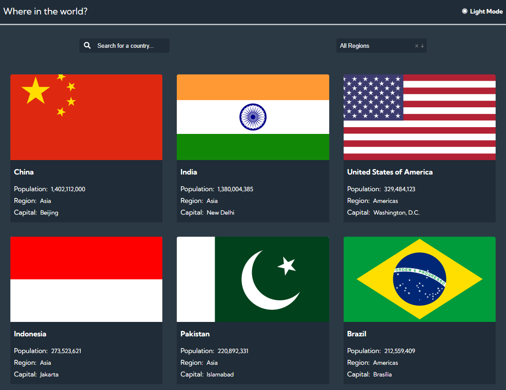
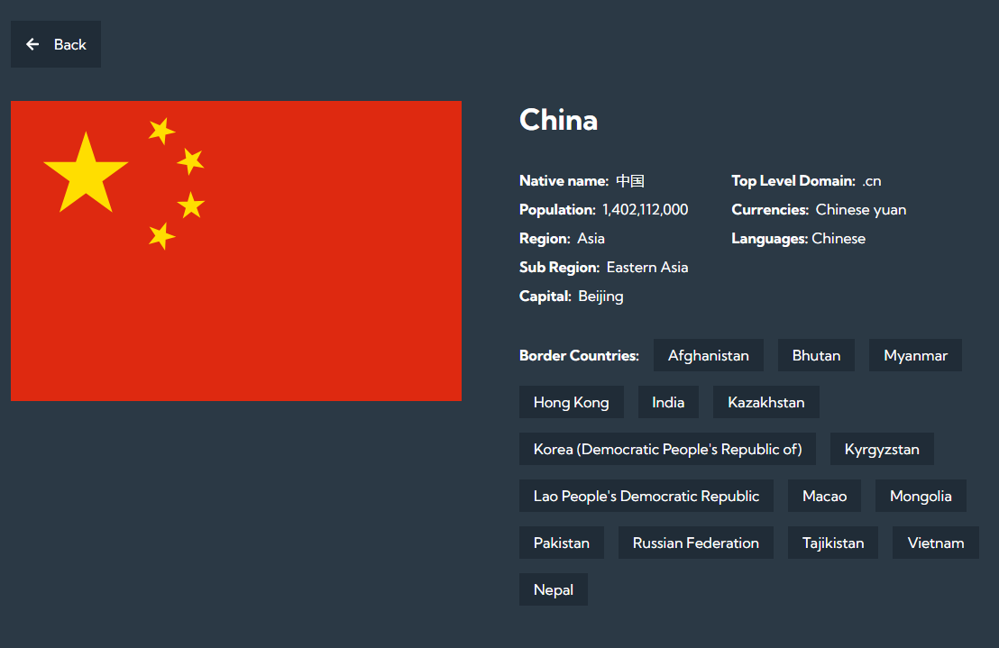

# FrontEnd Mentor Challange

This is a solution to the [REST Countries API with color theme switcher](https://www.frontendmentor.io/challenges/rest-countries-api-with-color-theme-switcher-5cacc469fec04111f7b848ca)

### Links

- [Solution URL](https://www.frontendmentor.io/challenges/rest-countries-api-with-color-theme-switcher-5cacc469fec04111f7b848ca)
- [Live Site URL](https://rest-valstis-api.netlify.app/)

### Built with

- Semantic HTML5 markup
- CSS3
- Flexbox
- CSS Grid
- [React Icons](https://react-icons.github.io/react-icons/) - NPM package
- [React Router](https://reactrouter.com/en/main) - NPM package
- [React](https://reactjs.org/) - JS library

### Screenshots

### What I learned

- How to implement context API - so that state and functions which I provided are accessible with the all the components which are wrapped inside the this context API
- Rect Outlet - used this feature which is provided from React router package to share <Header/> component for all my created pages for this project. Basically created <SharedLayout/> component which is passed to the Route as element, and then nesting other pages inside this Route so that they will share this <Header/> component
- Created my own custom Hook - which consisted of useState, useEffect hooks and a function for a purpouse to fetch data from API, which was then sorted respectivly by each countries population size. For better UX purpouses did set up loading feature, which appears while data is still getting imported to the project
